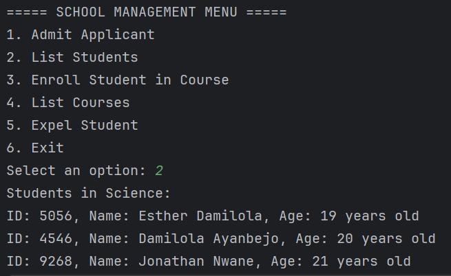
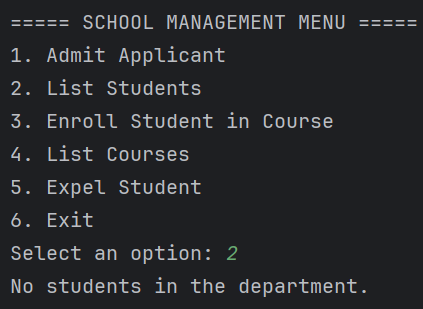
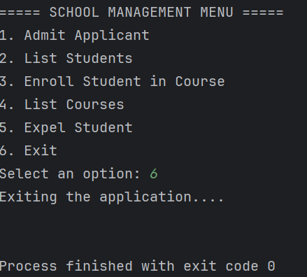

# DAVINA SCHOOLS

This project is meant to model a school depart to simulate the various functions of stackeholders in a school.

## APPLICATION RUN

When the application is run the menu below is displayed on the console

## STUDENT APPLICANT ADMISSION

For a student to complete the admission process, when the **"Admit Applicant"** option is chosen, an ID is generated for the student and the following details are required:
1. The Applicant name
2. The Applicant age

## LIST OF STUDENTS IN THE DEPARTMENT

When option 2 is selected, it displays the list of students in the department

If there are no students in the department, it displays the corresponding message.

## APPLICATION EXIT

Enter option 6 to exit the console application

### AUTHOR

Joseph Olukunle
